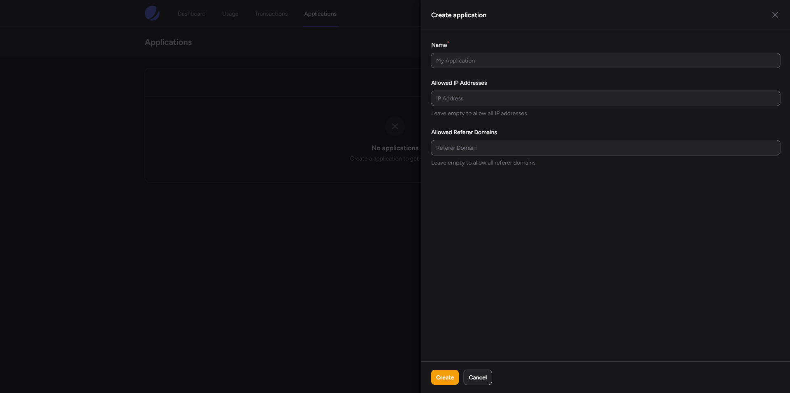
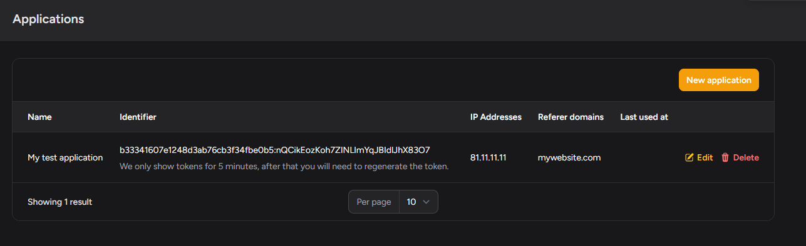

# Applications

Unlike many other address lookup APIs, we do not restrict your usage to one site or
application. You can use your tokens across multiple sites and applications.

## Creating an Application

To make requests to our API, you will need to generate an application.

Each application represents a website where the  API will be used. You can create as many applications as you need to 
help you manage your usage. When you generate an application, you will be given a key to use with any requests.

The only required field when creating an application is the name. You can restrict the usage of the application by 
IP address and referrer if you wish. More details on this can be found below.

## Restricting by IP Address

It may be useful for you to restrict the usage of your tokens to a specific IP address. This can be useful if you are
using the API on a server and want to ensure that the tokens cannot be used from anywhere else. You can add multiple
IP addresses to the list of allowed IP addresses in the applications page. The system will then check the incoming requests
and if they do not match the IP addresses in the list, the request will be rejected.

## Restricting by Referrer

You can also restrict the usage of your tokens to a specific referrer. This can be useful if you are using the API on a
website and want to ensure that the tokens cannot be used from anywhere else. You can add multiple referrers to the list
of allowed referrers in the applications page. The system will then check the incoming requests and if they do not match
the referrers in the list, the request will be rejected.
